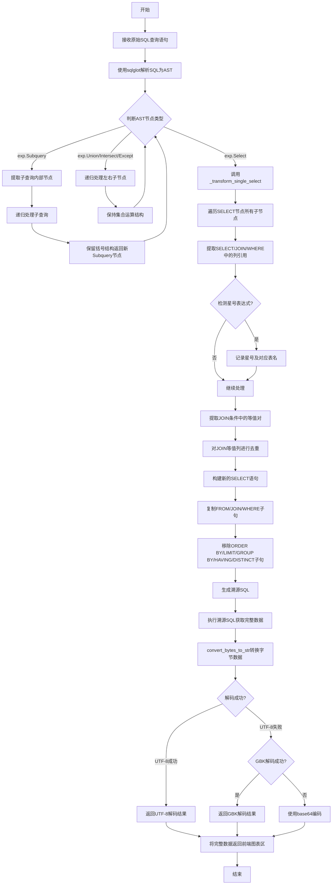
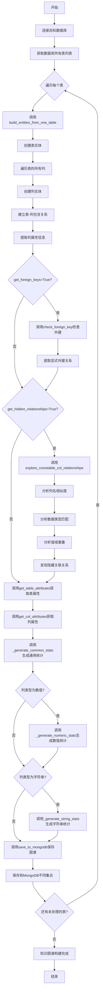
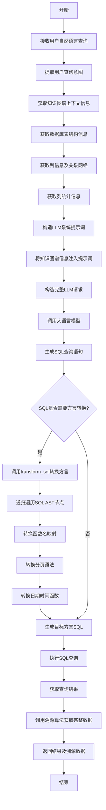
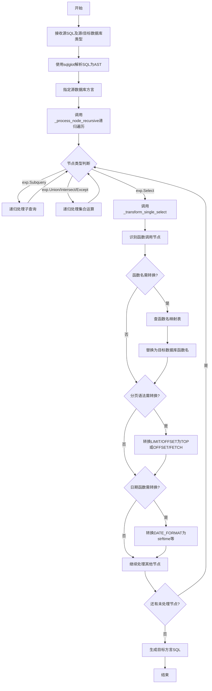
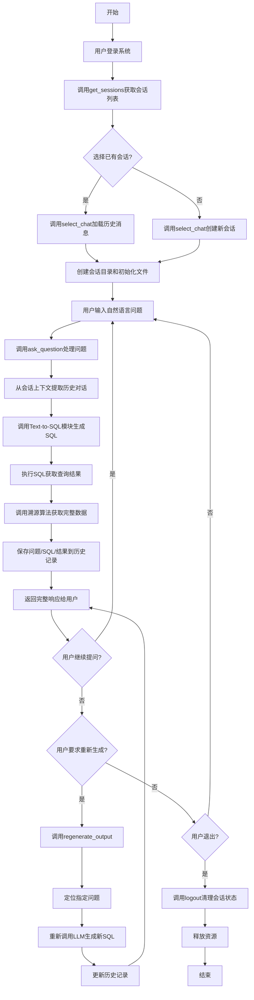
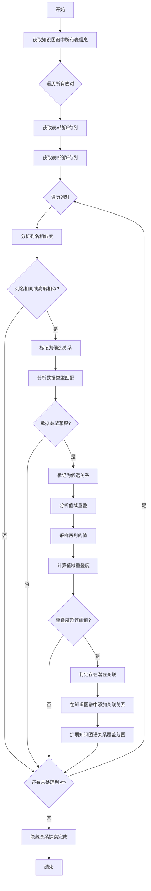

# 核心技术流程图

## 流程图1：基于AST递归解析的查询结果溯源流程

**说明**：本流程图展示了查询结果溯源算法的完整执行过程，从接收原始SQL到生成并执行溯源SQL，最终将完整数据返回前端。

## 流程图2：数据库知识图谱自动构建流程

**说明**：本流程图展示了从数据库Schema自动构建知识图谱的完整过程，包括实体构建、关系提取、属性获取和统计信息生成。

## 流程图3：知识图谱增强的Text-to-SQL转换流程

**说明**：本流程图展示了如何利用知识图谱上下文增强大语言模型，实现自然语言到SQL的准确转换。

## 流程图4：SQL方言自动转换流程

**说明**：本流程图展示了SQL方言自动转换模块的工作过程，支持不同数据库间的SQL语法适配。

## 流程图5：智能数据库代理会话管理流程

**说明**：本流程图展示了用户与智能数据库代理系统进行多轮问答交互的完整会话管理过程。

## 流程图6：隐藏关系探索算法流程

**说明**：本流程图展示了如何发现数据库中未通过外键约束显式定义的潜在关联关系。

