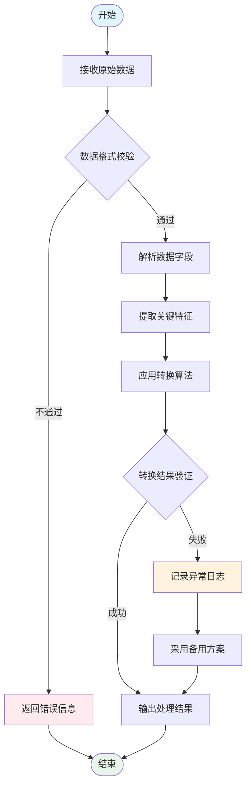
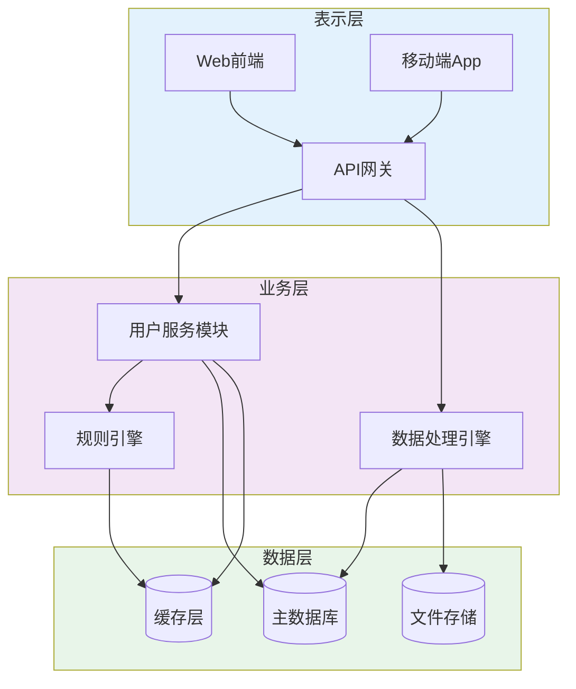
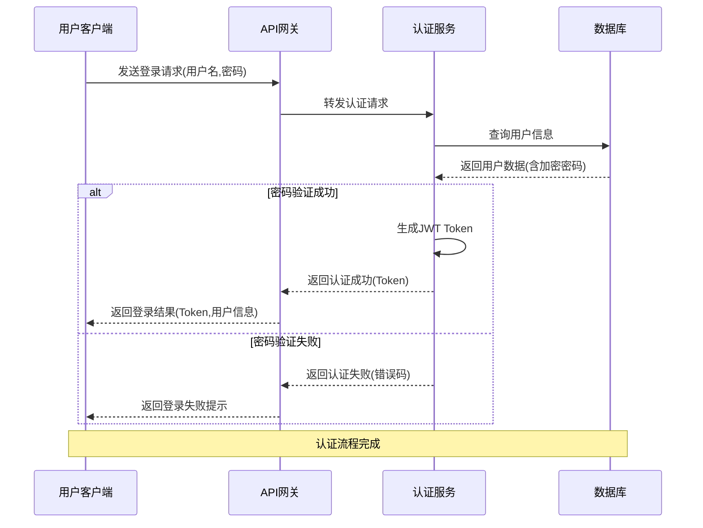
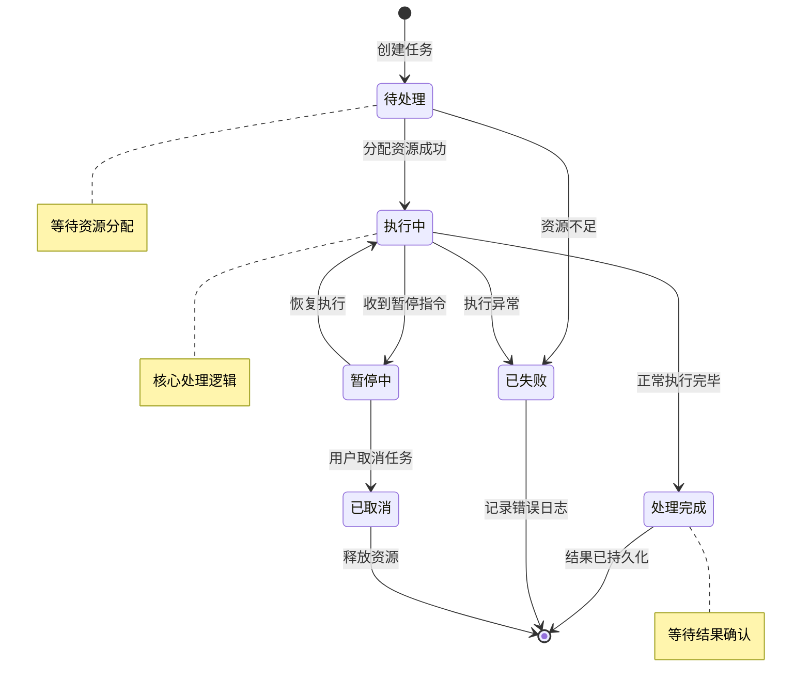
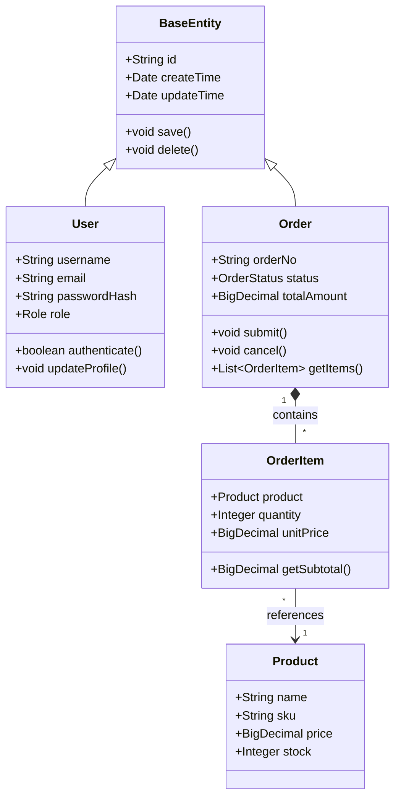

# 图表绘制规范

本文件定义了专利技术交底书中各类图表的绘制标准、Mermaid语法规范和示例。

## 核心原则

根据技术方案的**实际特点和表达需求**，**自主选择最合适的图表类型**。不同类型的专利、不同的技术内容，适合用不同的图来表达。

---

## 1. 图表类型选择指南

根据技术方案的特征，选择最适合的图表类型：

### 📋 方法流程图 (Flowchart)
- **适用场景**：算法流程、处理步骤、决策逻辑、操作序列
- **典型特征**：有明确的开始/结束、顺序执行、条件判断、循环结构
- **使用时机**：当技术方案主要描述"如何一步步完成某个任务"时

### 🏗️ 系统架构图 (System Architecture Diagram)
- **适用场景**：系统组成、模块关系、层级结构、组件交互
- **典型特征**：多个模块/组件、明确的层次关系、数据流向
- **使用时机**：当技术方案主要描述"系统由哪些部分组成、如何协作"时

### ⏱️ 时序图 (Sequence Diagram)
- **适用场景**：多对象交互、消息传递、调用顺序、协议流程
- **典型特征**：多个参与者、明确的时间顺序、请求-响应模式
- **使用时机**：当技术方案强调"多个组件之间如何按时间顺序交互"时

### 🔄 状态机图 (State Machine Diagram)
- **适用场景**：状态转换、生命周期、模式切换、条件触发
- **典型特征**：有限个状态、状态转换条件、事件驱动
- **使用时机**：当技术方案涉及"对象在不同状态之间如何转换"时

### 📊 类图/实体关系图 (Class/ER Diagram)
- **适用场景**：数据模型、类结构、继承关系、实体关联
- **典型特征**：类/实体定义、属性方法、关系连接
- **使用时机**：当技术方案的核心在于"数据结构或对象模型的设计"时

### 💡 智能选择策略
- 优先分析技术方案的本质特征（是流程？是架构？是交互？还是状态？）
- 可以**组合使用多种图表**来全面展示技术方案
- 对于复杂专利，建议：1张主图（核心流程或架构）+ 1~3张辅助图（细节展开）

---

## 2. 各类图表的 Mermaid 语法规范与示例

### 📋 类型1：方法流程图 (graph TD/LR)

#### 图形元素标准
- 矩形 `[文本]` → 处理步骤
- 菱形 `{文本}` → 判断/决策
- 圆角矩形 `([文本])` → 开始/结束
- 平行四边形 `[/文本/]` → 输入/输出
- 圆柱体 `[(文本)]` → 数据存储
- 箭头 `-->` → 流程方向

#### 内容要求
- 步骤描述使用动宾结构（如"获取数据库连接"、"解析SQL语句"、"计算覆盖率"）
- 判断分支标注条件（如"是否发现隐式外键？"、"覆盖率是否超过阈值？"）
- 循环结构明确标识循环条件和退出条件
- 与交底书中的技术步骤严格对应（建议在步骤描述中标注对应的章节编号）

#### 示例：数据处理方法流程图

---

### 🏗️ 类型2：系统架构图 (graph TB/TD)

#### 图形元素标准
- 矩形 `[文本]` → 功能模块/组件
- 圆角矩形 `([文本])` → 外部系统/接口
- 虚线矩形 `-.-[文本]-.-` → 边界/分组（用于标识层次）
- 箭头 `-->` → 数据流/调用关系
- 双向箭头 `<-->` → 双向交互

#### 内容要求
- 清晰展示系统的层次结构（如：表示层、业务层、数据层）
- 标注模块间的接口和数据流向
- 区分内部模块和外部依赖
- 体现模块的职责划分

#### 示例：分层系统架构图

---

### ⏱️ 类型3：时序图 (sequenceDiagram)

#### 图形元素标准
- `participant 名称 as 别名` → 定义参与者
- `->>` → 同步消息/请求
- `-->>` → 响应/返回值
- `->` → 异步消息
- `loop` / `alt` / `opt` → 循环/条件/可选块
- `note right/left of` → 注释说明

#### 内容要求
- 明确识别所有交互的参与者（对象、模块、系统）
- 按时间顺序展示消息传递
- 标注关键的请求参数和返回值
- 使用循环/条件块展示逻辑分支

#### 示例：用户认证交互时序图

---

### 🔄 类型4：状态机图 (stateDiagram-v2)

#### 图形元素标准
- `[*]` → 初始状态
- `[*]` → 最终状态
- `[状态名]` → 普通状态
- `-->` → 状态转换
- `: 事件/条件` → 转换触发条件

#### 内容要求
- 识别所有可能的状态
- 明确每个状态的进入和退出条件
- 标注触发状态转换的事件
- 展示完整的生命周期

#### 示例：任务处理状态机图

---

### 📊 类型5：类图/实体关系图 (classDiagram)

#### 图形元素标准
- `class 类名` → 定义类/实体
- `+属性: 类型` → 公有属性
- `-方法()` → 私有方法
- `|--|` 或 `<|--` → 继承关系
- `*--` 或 `o--` → 关联/聚合关系

#### 内容要求
- 展示核心实体/类的属性和方法
- 明确实体间的关系（一对一、一对多等）
- 体现继承和实现关系
- 标注关键的约束条件

#### 示例：数据模型类图

---

## 3. 图表绘制通用规范

### 语法规则
- 图表元素必须符合 Mermaid 语法规范，不能报错

### 命名规则
- 主流程图/系统框图通常作为图1
- 子模块图、数据流图等按在说明书中出现的先后顺序编号
- 图表名称应能准确反映其展示的内容（如"图1：数据采集主流程图"、"图2：系统整体架构图"）
- 文件内每个图表必须有清晰的标题注释

### 样式规范
- 必须使用适合专利申请的黑色线条、白色背景，不能使用其他颜色
- 避免过于花哨，确保专业性和可读性

### 内容规范
- 所有图表必须与交底书的技术方案严格对应
- 在图表的关键步骤/模块旁标注对应的交底书章节编号（如"参见5.2.1节"）
- 图表中的术语必须与交底书保持一致

### 复杂度控制
- 单个图表的节点数量建议控制在 15 个以内
- 每个节点内的文本内容建议控制在 15 字以内
- 如果流程过于复杂，考虑拆分为"主流程图" + "子流程详细图"
- 使用子图（subgraph）对相关模块进行分组，提升可读性

### 图表大小控制

**长度控制（纵向）**：
- **限制层级深度**：流程图最多 4~5 层嵌套，超过则必须拆分
- **避免线性串联**：不要将所有步骤排成一条长链，应合理使用分支和并行结构
- **合并同类步骤**：将连续的简单步骤合并为一个高层级节点，细节在子图中展开

**宽度控制（横向）**：
- **控制分支数量**：单个判断节点的分支不超过 3~4 个
- **避免宽幅展开**：不要让图表横向延伸过宽，优先使用上下布局（TD）而非左右布局（LR）
- **使用子图聚合**：将相关的并行步骤用 subgraph 分组，减少横向占用

**布局优化技巧**：
1. **调整方向**：纵向过长的图改用 `graph LR`（左右布局），横向过宽的图改用 `graph TD`（上下布局）
2. **提取公共路径**：多个分支共用的前后置步骤只画一次，用引用标注
3. **分层展示**：顶层图只画主干（8~12个节点），复杂模块用"详见子图X"替代
4. **使用引用节点**：对于已在他处详细展示的流程，用虚线框节点 `[→详见流程B]` 引用
